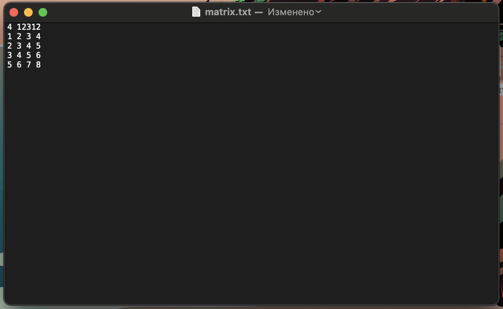
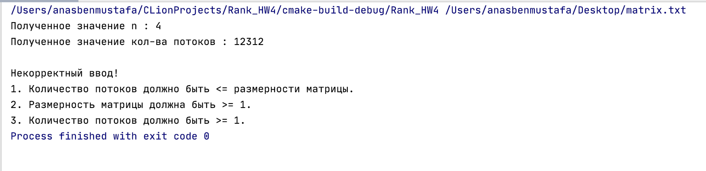
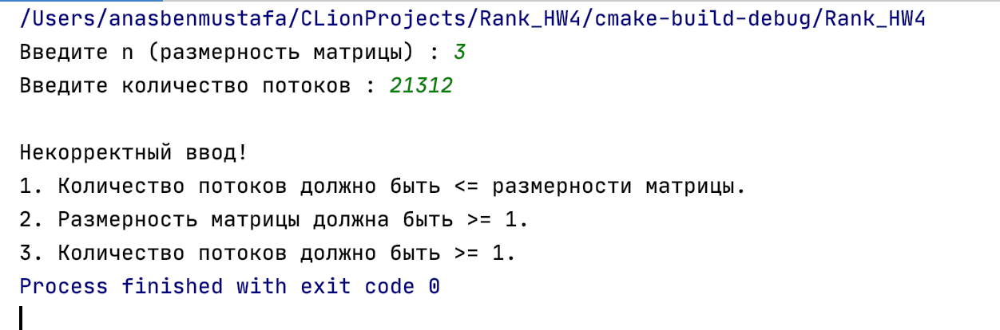
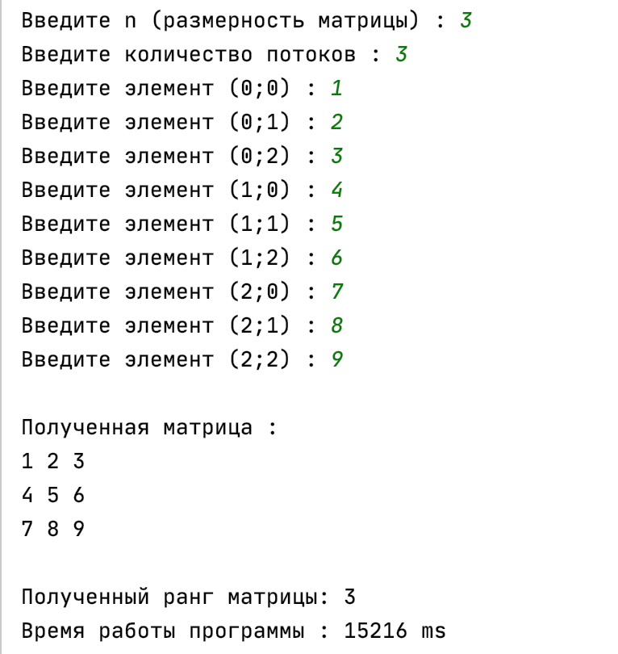
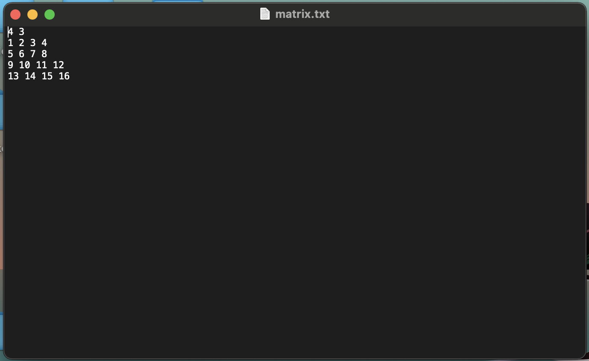
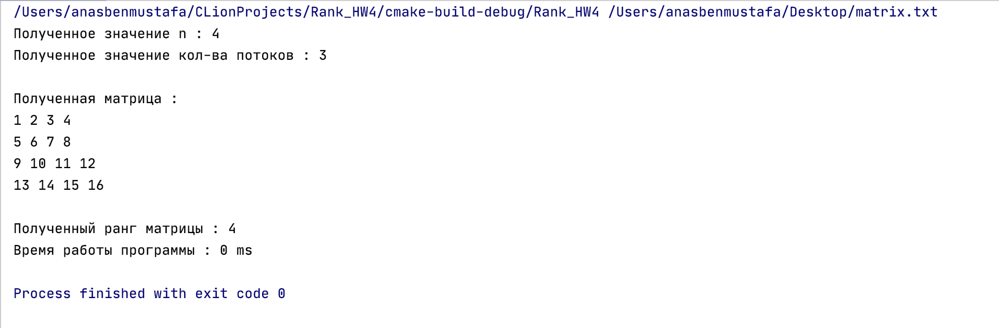

# Threads_HW_CPP
## Домашняя работа №4 по учебному курсу "Архитектура вычислительных систем", ПИ, 2 курс, НИУ ВШЭ. 
#### В качестве источников информации выступили:
<!--ts-->
  * https://habr.com/ru/post/443406/  
  * https://docs.microsoft.com/ru-ru/cpp/standard-library/thread-class?view=msvc-160&viewFallbackFrom=vs-2019  
  * https://l.wzm.me/_coder/custom/parallel.programming/001.htm  
<!--te-->
#### Пояснительная записка к проекту представлена [здесь](Materials/БенМустафа_191.pdf).
#### Код программы представлен [здесь](Code/main.cpp).
### Вариант 5. 
Определить ранг матрицы. Входные данные: целое положительное число n, произвольная матрица А размерности n х n. Количество потоков является входным параметром, при этом размерность матриц может быть не кратна количеству потоков.
## Результаты работы программы
Правильность выполнения работы была проверена на многих тестах, ниже будут представлены некоторые из них.
## Тесты 1 - 2 (некорректные данные)
По логике вещей, количество потоков, переданных программе пользователем, должно быть меньше или равно размерности матрицы. В программе для этого организована проверка.
- **Введём размерность матрицы = 4, кол-во потоков = 12312. Программа не отрабатывает, выписывая соответствующее предупреждение.** 
   
   
- **Введём размерность матрицы = 4, кол-во потоков = 12312 (теперь уже ручным вводом). Программа не отрабатывает, выписывая соответствующее предупреждение.** 
   
## Тест 3 - 4 (корректные данные)
-**Ручной ввод параметров и матрицы.**
   
-**Считывание параметров и матрицы из файла.**
   
   
